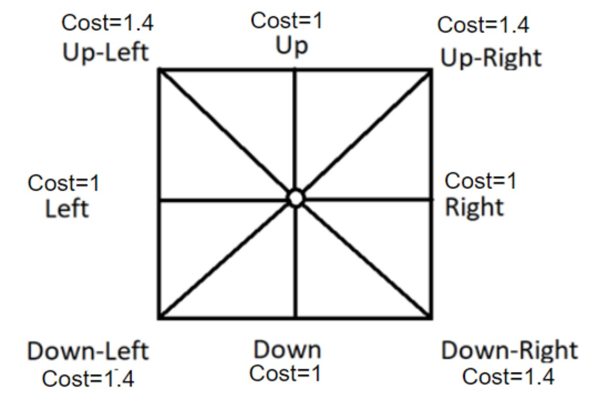
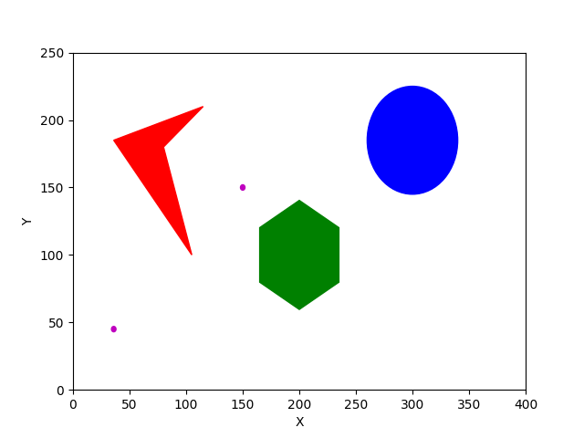
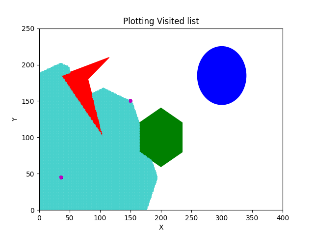
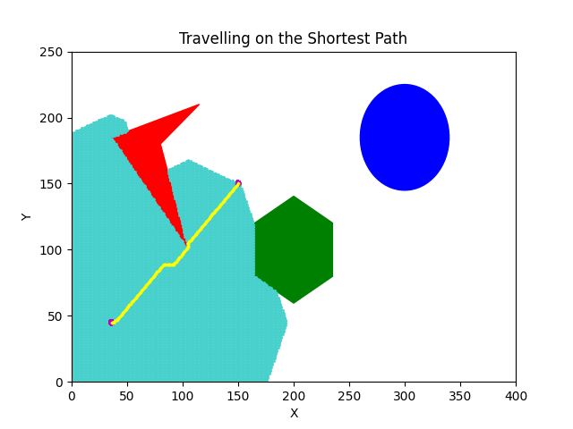

<!-- Download the zip file to a folder of your choice and extract the zip file

In it open the "Dijkstra.py" file in any IDE of your choice, preferably VS Code
Hit the run button in the IDE and the code will prompt you for inputs, give the necessary inputs
If acceptable inputs are given, the code will run and execute the Dijkstra algorithm and generate the shortest path
Once the path is generated, it will plot all the visited nodes and then the path of the travel
You can try for different inputs as required, as long as they are accepted by the program -->
# DIJKSTRA - Path Planning Algorithm for a Point Robot

The task was to designing a point robot that would traverse a map where the obstacels are already known to us. <br>
We have a point robot that can move in eight directions and each action would have its respective costs.


## Defining the map
We use the concepts of Algebraic Half planes to define the free space and the obstacles.<br>


## Exploring the Map
Use the defined actions set and as per the cost for each step, we traverse the graph
```
Action Sets = {(1,0), (-1,0), (0,1), (0,-1), (1,1), (-1,1),(1,-1),(-1,-1)}
```
In each action set generated we check if the new position is going to end up in the obstacle space.


## Optimal path
After we explore the entire map, we use backtracking to find the path with the least cost. <br> The operation of the algorithm is shown below. <br>


## Usage
* Clone the repo to your local machine
```
git clone https://github.com/HemanthJoseph/Dijkstra-Path-Planning-Point-Robot.git
```
* Change Directory
```
cd Dijkstra_Algorithm
```
* Run the python file
```
python Dijkstra.py
```
* In the command line enter the inputs values for start and goal coordinates and ensure that the points don't fall in the obstacles as the program will keep prompting you to enter points that aren't in the obstacle space.


## Video Link
https://drive.google.com/file/d/1XJp1R0PteTrX_R4la_C7ffUnGrDoOqul/view?usp=share_link